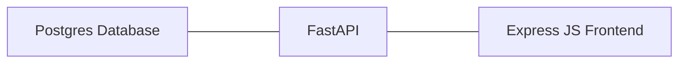

The Application consists of three components - a Postgres database, a FastApi server and an Express JS frontend. The Postgres database stores a number of grocery items with their name, unit and price. This database is queried by the FastApi microservice, which has two main endpoints `/items/random`, which returns a random item from the database, and `/items/all`, which lists the full grocery item table. To better display this results to a user, the Express JS Microservice is deployed and enabled to call the FastApi Endpoints.